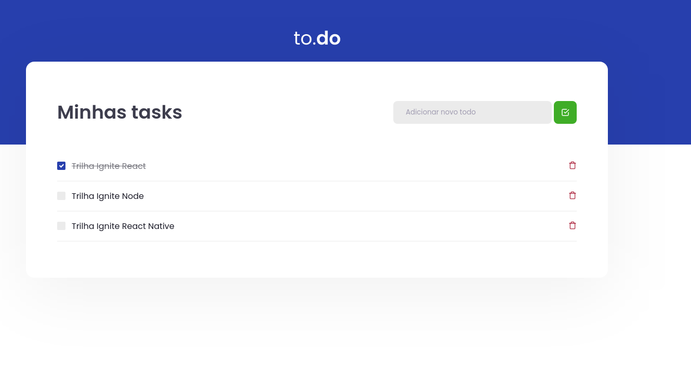

# Desafio 01 - Conceitos do React

<p align="center">


<br>

<p align="center"><em>Confira o resultado do desafio em: <a href="https://to-do-rocketseat-vitor.netlify.app" target="_blank">to-do-rocketseat-vitor.netlify.app</a></em></p>

## :computer: Sobre o desafio

<hr>

Nesse desafio, você deverá criar uma aplicação para treinar o que aprendeu até agora no ReactJS.
<br>
Essa será uma aplicação onde o seu principal objetivo é uma pequena aplicação de atividades a fazer, para treinar um pouco mais sobre manipulação do estado no React.

- Adicionar uma nova tarefa
- Marcar e desmarcar uma tarefa como concluída
- Remover uma tarefa

## Imagens

<div>
   
   
</div>

## :rocket: Techs

<ul>
  <li> HTML</li>
  <li> SCSS </li>
  <li> Javascript </li>
  <li> TypeScript </li>
  <li> ReactJS </li>
  <li> Jest </li>
  <li> Babel </li>
  <li> Webpack </li>
</ul>

## Desenvolvimento

---

### Pré-requisitos

- Instalar [Node.js](https://nodejs.org)

- Instalar [Yarn](https://yarnpkg.com/)

### Clone o repositório

```bash
$ git@github.com:vitorgaletti/ignite-reactjs-to-do.git
```

### Executar Projeto

```bash
# Mudar para directório
$ cd ignite-reactjs-to-do
```

- Instalar dependências

```bash
$ yarn
```

- Execute

```bash
$ yarn dev
```

- Executar scripts

|           Ação            |  Utilização  |
| :-----------------------: | :----------: |
| Iniciar o desenvolvimento |  `yarn dev`  |
|  Compilar para produção   | `yarn build` |
